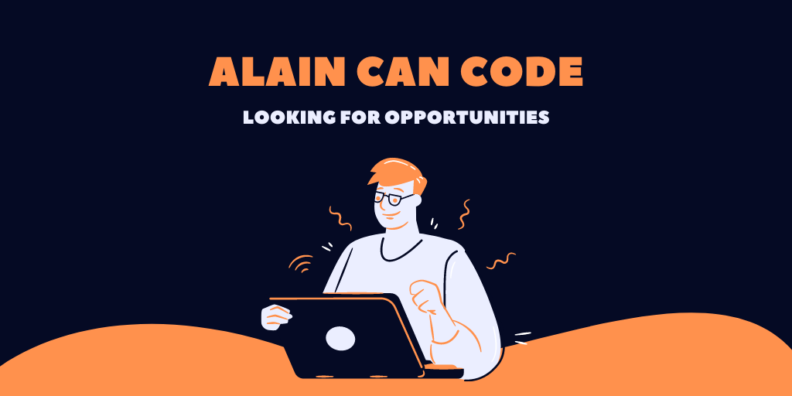

<!--
**wildeng/wildeng** is a ✨ _special_ ✨ repository because its `README.md` (this file) appears on your GitHub profile.

Here are some ideas to get you started:

- 🔭 I’m currently working on ...
- 🌱 I’m currently learning ...
- 👯 I’m looking to collaborate on ...
- 🤔 I’m looking for help with ...
- 💬 Ask me about ...
- 📫 How to reach me: ...
- 😄 Pronouns: ...
- ⚡ Fun fact: ...
-->
### Ay-Up!

I'm Alain and I like playing with computers, therefore, when not occupied with something else, I code.

You can find me on the Internet in different places:

* my [personal place](https://alainmauri.eu)
* [DEV](https://dev.to/wildeng)
* On Twitter [@wildeng](https://twitter.com/wildeng)
* On [LinkedIn](https://www.linkedin.com/in/alainmauri/)

I have  many ideas and I'm currently looking for new opportunities!

Cheers!
